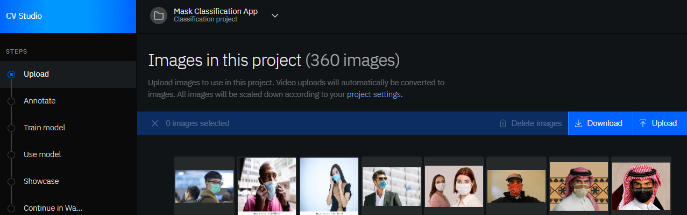
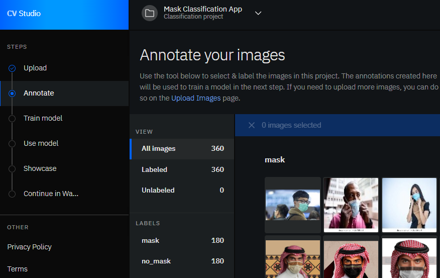
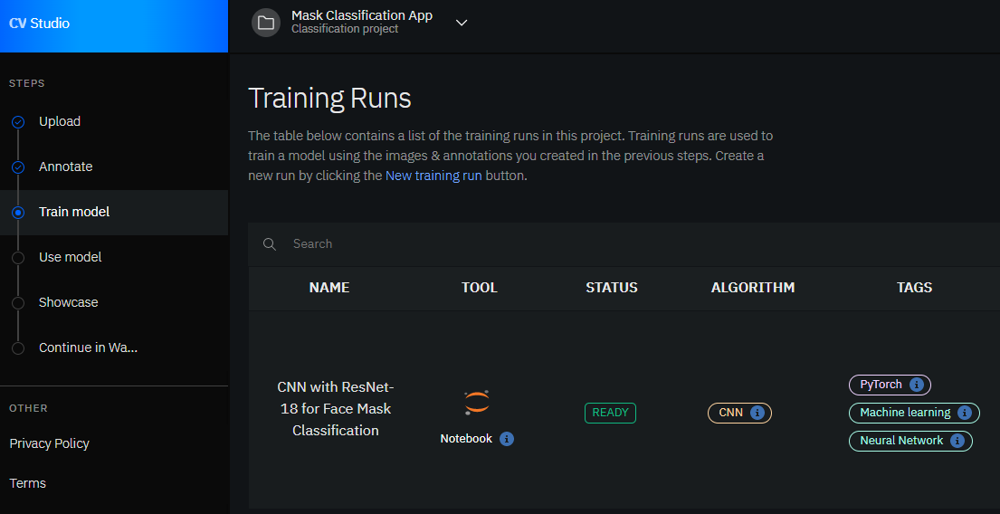
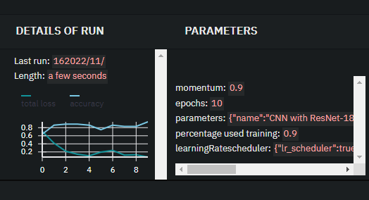
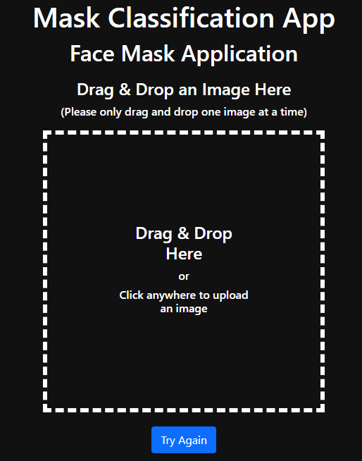

# Project Objective

Design, train, and test deep convolutional neural networks with transfer learning to perform a face mask classification task with PyTorch and IBM Computer Vision Studio.

----------------------------------------------------------

# CV Studio

When building Computer Vision applications, we deal with a lot of images, videos, and other assets that require storage. Image processing also requires significant computing power. The ultimate goal of every computer vision project is to have it deployed as part of an application and every application requires infrastructure to run.  

[NumPy](http://www.numpy.org/)

[CV Studio](https://vision.skills.network/?utm_medium=Exinfluencer&utm_source=Exinfluencer&utm_content=000026UJ&utm_term=10006555&utm_id=NA-SkillsNetwork-Channel-SkillsNetworkCoursesIBMDeveloperSkillsNetworkCV0101ENCoursera25797139-2022-01-01/)  is a Computer Vision learning tool for building, running, and managing AI Vision computer models and optimizing decisions anywhere on the IBM Cloud. It uses cutting-edge tools like Jupyter Notebook, Watson Machine Learning, Elyra, and more. 

----------------------------------------------------------

# Project steps / pipline:

  * ## 1- Built the dataset

  After logging into CV Studio and creating a new project, I collected and uploaded 360 images divided into 180 images of people wearing masks and 180 images of people without masks on their faces.

  

  ----------------------------------------------------------

  * ## 2- Annotate the dataset

  Since I named both of my folders with the respective categories (mask, no_mask) when I uploaded my images in the previous upload step, the annotation happened automatically on CV Studio.     

  And here in the annotate section, I verified that my images are labeled as expected.

  

  ----------------------------------------------------------

  * ## 3- Train the model

  I chose a Jupyter notebook as a "Training tool" and used the image annotations from the previous step to train a CNN model using transfer learning (using the `ResNet` pre-trained model as a fixed feature extractor) to perform a face mask classification task with PyTorch. 

  
   

  ----------------------------------------------------------

  * ## 4- Test the model

  To test the classifier, enter the URL of the web app below into any web browser, and enjoy testing the model:

  `
  https://face-mask-application-6364868bf3cbb858b65c1d1a.u8wpmjcrkw2.eu-gb.codeengine.appdomain.cloud/
  `

  Upload or drop & drag an image into the box and the prediction of the deep network will show at the bottom.

  

----------------------------------------------------------

# Notes & Results 

By feeding the classifier with *** images, it gets the chance to learn and gather enough information about mask and no_mask data, and understand the relationship between input and output, and as a result,the accuracy of the classifier is  which is promacing and indicate a good performance and accurate predictions.

I tested the app on several images, and the overall performance of the classifier seems very good.

Thus, no need to retrain the classifier nor gathering more data.

However, the classifier failed to correctly classify the images below.

correct no_mask1 prediction:

correct no_mask2 prediction:

correct no_mask3 prediction:

correct no_mask4 prediction:

correct no_mask5 prediction: 

correct no_mask6 prediction: 

correct no_mask7 prediction:

correct no_mask8 prediction:

correct no_mask9 prediction:

correct no_mask10 prediction:

correct no_mask11 prediction:

correct no_mask12 prediction:

correct no_mask13 prediction:

correct no_mask14 prediction:

correct no_mask15 prediction:

